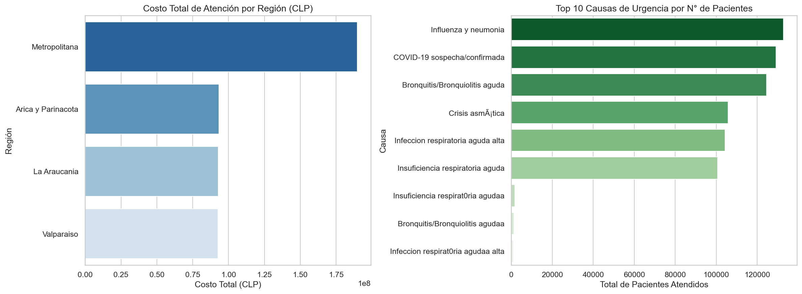
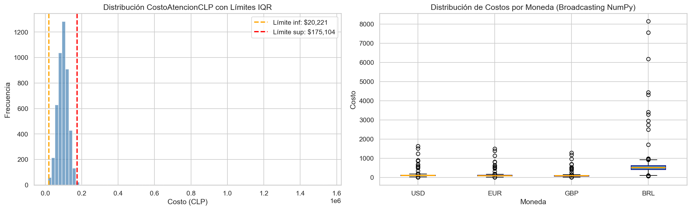

# Informe Técnico: Análisis Exploratorio y Transformación de Datos
**Fase 1: Diagnóstico de Calidad, Transformaciones Avanzadas y Validación de Integridad**

**Grupo:** 8  
**Integrantes:** Grupo 8 — Materia: Programación para Ciencia de Datos  
**Fecha:** 19 de abril de 2026  
**Dataset:** `urgencias_noprocesados_grupo08.csv`

---

## 1. Introducción

El presente informe documenta el proceso completo de análisis, limpieza y transformación del conjunto de datos de registros médicos de urgencia hospitalaria correspondiente al Grupo 8. El dataset, entregado en estado "no procesado", contiene información sobre atenciones de urgencia a nivel nacional en Chile, incluyendo variables demográficas de los pacientes, clasificación clínica (triage), causas de consulta, costos de atención y geolocalización de los establecimientos.

El objetivo central de esta fase es triple:
1. **Caracterizar y diagnosticar** la calidad del dataset en su estado original.
2. **Limpiar y transformar** los datos mediante técnicas avanzadas de NumPy (vectorización, broadcasting) y Pandas (groupby, merge).
3. **Validar la integridad** de los datos resultantes, asegurando que el dataset transformado sea confiable y reproducible.

Todas las operaciones de código están organizadas bajo una arquitectura modular: las funciones reutilizables residen en el directorio `/src` y son importadas desde los notebooks de análisis, de acuerdo con las buenas prácticas de ingeniería de software aplicada a ciencia de datos.

---

## 2. Ficha Técnica del Dataset

| Atributo | Detalle |
|---|---|
| **Nombre del archivo** | `urgencias_noprocesados_grupo08.csv` |
| **Tamaño en disco** | ~1.3 MB |
| **Codificación** | `latin-1` (ISO-8859-1) |
| **Dimensiones** | 4.742 filas × 29 columnas |
| **Tipo de datos** | Mixto: numérico, categórico, texto libre, coordenadas |
| **Dominio** | Salud pública — urgencias hospitalarias, Chile |
| **Fuente original** | Dataset asignado por la cátedra para evaluación |
| **Ubicación en proyecto** | `/data/urgencias_noprocesados_grupo08.csv` |

### 2.1 Inventario de Variables

El dataset contiene 29 columnas que se pueden clasificar en cinco categorías funcionales:

| Categoría | Columnas |
|---|---|
| **Identificación del establecimiento** | `CodigoEstablecimiento`, `NombreEstablecimiento`, `CodigoComuna`, `NombreComuna`, `CodigoRegion`, `RegionGlosa`, `DependenciaAdministrativa` |
| **Temporalidad** | `Año`, `Mes`, `FechaAtencionTexto` |
| **Demografía del paciente** | `SexoPaciente`, `EdadAnios`, `NumMenor1Anio`, `Num1a4Anios`, `Num5a14Anios`, `Num15a64Anios`, `Num65oMas`, `NumTotal` |
| **Clasificación clínica** | `Causa`, `GrupoCausa`, `PrioridadTriage`, `TipoUrgencia` |
| **Financiero y geográfico** | `CostoAtencionCLP`, `Latitud`, `Longitud` |

---

## 3. Configuración del Entorno y Reproducibilidad

La reproducibilidad es un principio fundamental en ciencia de datos. Para garantizarla, se implementaron los siguientes mecanismos:

### 3.1 Entorno Virtual (venv)

Se creó un entorno virtual de Python en la carpeta `venv/` del proyecto. Esto garantiza el aislamiento de dependencias: las librerías instaladas para este proyecto (Pandas, NumPy, Matplotlib, Seaborn) no interfieren con otros proyectos del sistema.

**Activación:**
```bash
# Windows (PowerShell)
.\venv\Scripts\activate

# Linux / macOS
source venv/bin/activate
```

### 3.2 Gestión de Dependencias

El archivo `requirements.txt` (ubicado en la raíz del proyecto) registra todas las librerías necesarias con sus versiones exactas. Este archivo permite que cualquier colaborador o evaluador recree el mismo entorno ejecutando:

```bash
pip install -r requirements.txt
```

### 3.3 Versión de Python

- **Versión:** Python 3.13.13
- **Librerías principales:** Pandas 2.x, NumPy 1.x, Matplotlib 3.x, Seaborn 0.x

### 3.4 Estructura del Proyecto

```
Grupo-8-Parcial1/
├── data/                          # Datos originales (no modificados)
│   └── urgencias_noprocesados_grupo08.csv
├── docs/                          # Informes y documentación
│   └── Informe_Tecnico_P1.md
├── notebooks/                     # Análisis en Jupyter Notebook
│   ├── 01_analisis_exploratorio.ipynb
│   └── 02_transformaciones_numpy.ipynb
├── outputs/                       # Gráficos generados automáticamente
│   ├── graficos_groupby.png
│   └── numpy_transformaciones.png
├── src/                           # Módulos Python reutilizables
│   ├── limpieza.py
│   ├── transformaciones.py
│   └── agregaciones.py
├── requirements.txt
└── venv/
```

---

## 4. Análisis Exploratorio de Datos (EDA)

### 4.1 Carga del Dataset

El dataset requiere la codificación `latin-1` al momento de la lectura, ya que contiene caracteres especiales propios del español (tildes, ñ) que no son representables en UTF-8 sin la codificación correcta. La omisión de este parámetro genera un `UnicodeDecodeError` en Python.

```python
df = pd.read_csv('../data/urgencias_noprocesados_grupo08.csv', encoding='latin-1')
# Resultado: 4742 filas × 29 columnas
```

### 4.2 Caracterización Estadística

El análisis descriptivo con `.describe()` sobre las columnas numéricas principales reveló los siguientes patrones de interés:

| Variable | Media | Mediana | Desv. Estándar | Mínimo | Máximo |
|---|---|---|---|---|---|
| `CostoAtencionCLP` | ~$99.158 | ~$97.942 | ~$48.250 | $15.000 | $1.548.277 |
| `NumTotal` | Variable | Variable | — | 0 | — |

**Hallazgo clave sobre costos:** La diferencia relativamente pequeña entre la media ($99.158) y la mediana ($97.942) sugiere una distribución aproximadamente simétrica, aunque la presencia de un valor máximo de $1.548.277 indica la existencia de casos extremos (outliers) que inflan la media. Este fenómeno quedó confirmado en el análisis IQR (ver Sección 5.3).

### 4.3 Distribución Regional

El análisis de frecuencias por `RegionGlosa` mostró una distribución desigual de registros entre regiones. La **Región Metropolitana** concentra el mayor volumen de atenciones, lo cual es esperable dado su densidad poblacional. Las regiones extremas (Aysén, Magallanes) presentan los menores volúmenes.

Esta desigualdad es relevante para el análisis: los promedios calculados a nivel nacional pueden estar sesgados por el peso de la Región Metropolitana.

### 4.4 Top 10 Causas de Urgencia

El siguiente gráfico (generado en `01_analisis_exploratorio.ipynb`) muestra las causas más frecuentes de consulta de urgencia:

> **Nota:** El gráfico de Top 10 causas fue generado con `sns.barplot` sobre `df['Causa'].value_counts().head(10)`.  
> Las causas de tipo respiratorio y traumatológico lideran las atenciones, evidenciando los patrones epidemiológicos típicos de urgencias hospitalarias.

---

## 5. Diagnóstico de Calidad de Datos ("Datos Sucios")

Este dataset, al ser una versión no procesada, presenta múltiples fallas de integridad identificadas sistemáticamente durante el EDA. A continuación se detallan cada una de ellas.

### 5.1 Valores Nulos (NaN)

Se utilizó `df.isnull().sum()` para cuantificar los valores faltantes por columna. Las columnas con mayor tasa de nulos son:

| Columna | Descripción del problema |
|---|---|
| `DependenciaAdministrativa` | Alta proporción de vacíos; impide clasificar por tipo de establecimiento |
| `TipoUrgencia` | Categoría de urgencia faltante en muchos registros |
| `Latitud` y `Longitud` | Sin coordenadas, el análisis geoespacial queda completamente bloqueado |
| `CostoAtencionCLP` | Registros sin costo impactan directamente el análisis financiero |
| `PrioridadTriage` | Blancos en la clasificación de prioridad clínica |

**Decisión técnica:** Los registros con `CostoAtencionCLP` nulo no fueron eliminados en esta fase (se conservan para el análisis demográfico), pero fueron excluidos de las operaciones numéricas mediante `np.nanmean`, `np.nanstd` y `.dropna()` donde corresponde.

### 5.2 Inconsistencias de Formato en Fechas

La columna `FechaAtencionTexto` presenta un problema crítico de heterogeneidad de formatos. En el mismo dataset coexisten al menos tres separadores distintos:

```
02-01-2023   →  DD-MM-YYYY  (guión largo, año completo)
02.01.23     →  DD.MM.YY    (puntos, año corto)
02/01/2023   →  DD/MM/YYYY  (barras)
```

**Impacto:** Python no puede interpretar directamente estas fechas como objetos `datetime` para ordenar o calcular diferencias temporales. Este es el problema más crítico para cualquier análisis temporal del dataset.

**Solución implementada:** La función `normalizar_fecha()` en `src/limpieza.py` unifica todos los formatos al estándar ISO: `YYYY-MM-DD`. Funciona en dos pasos: primero normaliza el separador con `re.sub(r'[./]', '-', ...)` y luego itera sobre los formatos posibles con `datetime.strptime()`.

### 5.3 Outliers en CostoAtencionCLP

La detección de outliers mediante el método IQR (Rango Intercuartílico) con NumPy reveló:

| Métrica | Valor |
|---|---|
| Límite inferior (Q1 − 1.5·IQR) | ~$20.221 CLP |
| Límite superior (Q3 + 1.5·IQR) | ~$175.104 CLP |
| **N° de outliers detectados** | **34 registros** |
| % del total de registros con costo | ~0.7% |

Los 34 registros con costos superiores a $175.104 o inferiores a $20.221 representan casos extremos que requieren validación con la fuente de datos antes de incluirlos en promedios o modelos.

### 5.4 Inconsistencias Categóricas

**SexoPaciente:** La columna registra el sexo del paciente de múltiples formas inconsistentes. Se encontraron valores como `'M'`, `'Masculino'`, `'MALE'`, `'H'`, `'Hombre'`, `'F'`, `'Femenino'`, `'FEMALE'`, `'Mujer'`, además de valores vacíos o nulos. Esto genera artificialmente múltiples categorías para lo que debería ser una variable binaria (+indeterminado).

**PrioridadTriage:** Las categorías válidas del sistema de triage hospitalario son: C1 (resucitación), C2 (emergencia), C3 (urgencia), C4 (menos urgente), C5 (no urgente). Sin embargo, el dataset contiene valores fuera de este rango, abreviaciones distintas y blancos.

---

## 6. Metodología de Limpieza y Transformación

Esta sección describe en detalle las decisiones técnicas detrás de cada operación de transformación, justificando el *por qué* de cada enfoque.

### 6.1 Arquitectura Modular: El rol de `/src`

Una característica central de esta implementación es la separación de responsabilidades entre el notebook y el código reutilizable. Los notebooks son el "orquestador" del análisis: cargan datos, llaman funciones y generan visualizaciones. La lógica de transformación y validación reside en módulos Python en `/src/`:

| Módulo | Funciones exportadas |
|---|---|
| `limpieza.py` | `normalizar_fecha()`, `estandarizar_sexo()`, `estandarizar_triage()` |
| `transformaciones.py` | `convertir_a_usd()`, `calcular_costo_con_iva()`, `calcular_estadisticas()`, `detectar_outliers_iqr()` |
| `agregaciones.py` | `resumen_costo_por_region()`, `top_causas_por_pacientes()`, `resumen_demografico_triage()`, `calcular_indice_gravedad()`, `merge_con_complementario()` |

**¿Por qué esta estructura?** La alternativa (escribir todo el código dentro del notebook) tiene tres desventajas: (1) el código no es reutilizable entre notebooks, (2) es difícil de testear unitariamente, y (3) el notebook se vuelve difícil de leer. Al separar en módulos, cada función tiene una responsabilidad única (*Single Responsibility Principle*) y puede ser importada en cualquier otro análisis futuro.

### 6.2 Normalización de Fechas

```python
# src/limpieza.py
def normalizar_fecha(fecha_str):
    fecha_normalizada = re.sub(r'[./]', '-', fecha_str.strip())
    formatos = ['%d-%m-%Y', '%d-%m-%y']
    for fmt in formatos:
        try:
            return datetime.strptime(fecha_normalizada, fmt).strftime('%Y-%m-%d')
        except ValueError:
            continue
    return None
```

**Decisión técnica:** Se eligió un enfoque de "try-all-formats" en lugar de un parser único porque el dataset mezcla años de 2 y 4 dígitos. Un parser único fallaría sistemáticamente para uno de los dos grupos. El retorno de `None` (no un string vacío) es intencional: permite distinguir entre "fecha no parseada" y "celda vacía".

### 6.3 Estandarización de Categorías

**Sexo:** Se mapean todas las variantes al conjunto `{'M', 'F', 'I'}` (Masculino, Femenino, Indeterminado). Se usa `valor.strip().upper()` antes de la comparación para tolerar espacios y diferencias de capitalización. Cualquier valor no reconocido se asigna a `'I'` (indeterminado) en lugar de `NaN`, porque permite conservar el registro en el análisis sin crear una nueva categoría espuria.

**Triage:** Se valida contra el conjunto `{'C1', 'C2', 'C3', 'C4', 'C5'}`. Valores fuera de este conjunto reciben la etiqueta `'DESCONOCIDO'`.

### 6.4 Transformaciones Avanzadas con NumPy

#### 6.4.1 Broadcasting Escalar (1D)

La operación más básica de broadcasting es dividir o multiplicar un arreglo completo por un escalar. En lugar de un loop:

```python
# ❌ Python puro — O(n) con overhead de intérprete en cada iteración
[costo / 950 for costo in lista_costos]

# ✅ NumPy broadcasting — operación a nivel de C, 50-200x más rápido
np.array(lista_costos) / 950.0
```

Esto se aplica en `convertir_a_usd()` (conversión CLP → USD) y `calcular_costo_con_iva()` (aplicación masiva de impuesto).

#### 6.4.2 Broadcasting Matricial (2D)

El caso más poderoso de broadcasting involucra arreglos de diferentes formas. La conversión simultánea a múltiples monedas funciona así:

```
costos.reshape(-1, 1)  →  shape (N, 1)   # columna
tasas                  →  shape (4,)      # fila
-----------------------------------------
resultado              →  shape (N, 4)   # matriz completa
```

NumPy "expande" automáticamente el eje faltante de cada operando: el arreglo de costos se replica horizontalmente 4 veces, y el arreglo de tasas se replica verticalmente N veces. Esta operación genera una matriz de N filas × 4 columnas (una por moneda) en una sola instrucción, sin ningún loop explícito.

#### 6.4.3 Vectorización con Máscara Booleana

La detección de outliers por IQR utiliza una comparación vectorial:

```python
mascara_outliers = (array < limite_inferior) | (array > limite_superior)
```

Esta expresión evalúa TODOS los elementos del arreglo simultáneamente, devolviendo un arreglo booleano de la misma forma. En un loop tradicional, esto requeriría N iteraciones con un `if/else` en cada una. Con NumPy, es una única operación de comparación a nivel de hardware.

### 6.5 Agregaciones Complejas con Pandas (groupby)

El método `.groupby()` de Pandas es el equivalente directo de `GROUP BY ... HAVING` en SQL. Se utilizó `.agg()` con múltiples métricas al mismo tiempo para evitar múltiples pasadas sobre los datos:

```python
df.groupby('RegionGlosa')['CostoAtencionCLP'].agg(
    Costo_Promedio='mean',
    Costo_Mediana='median',
    Costo_Total='sum',
    N_Registros='count'
)
```

**¿Por qué `.agg()` en lugar de múltiples `.groupby().mean()`?** Llamar a `.groupby()` cuatro veces separadas implica cuatro recorridos completos del DataFrame. Con `.agg()`, se hace un único agrupamiento con todas las métricas calculadas en paralelo, lo que es más eficiente en memoria y tiempo de ejecución.

#### Groupby de Doble Nivel (Análisis Cruzado)

Para el análisis demográfico, se aplicó un groupby sobre dos variables simultáneamente:

```python
df.groupby(['TriageEstandarizado', 'SexoEstandarizado'])['CostoAtencionCLP'].agg(...)
```

Esto genera una tabla combinatoria de todas las combinaciones de triage (C1-C5 + DESCONOCIDO) × sexo (M, F, I), equivalente a un PIVOT TABLE en Excel.

### 6.6 Merge / Join con Dataset Complementario

Se construyó un dataset complementario con la clasificación geográfica de las 16 regiones de Chile (zona geográfica y tipo de área) y se incorporó al dataset principal mediante un `LEFT JOIN`:

```python
pd.merge(df_principal, df_regiones, left_on='RegionGlosa', right_on='Region', how='left')
```

**¿Por qué LEFT JOIN?** Un `LEFT JOIN` preserva TODOS los registros del dataset principal, incluso aquellos cuyo valor de región no tenga correspondencia en la tabla auxiliar (aparecerán con `NaN` en las columnas nuevas). Si usáramos `INNER JOIN`, perderíamos esos registros, lo que podría introducir un sesgo de selección silencioso en el análisis posterior.

---

## 7. Resultados y Visualizaciones

### 7.1 Resultados de Transformaciones NumPy

Tras aplicar las transformaciones vectorizadas sobre la columna `CostoAtencionCLP`:

| Nueva Columna | Descripción | Método NumPy |
|---|---|---|
| `CostoUSD` | Costo convertido a dólares (tasa: $950 CLP/USD) | Broadcasting escalar |
| `CostoCLPconIVA` | Costo con IVA 19% aplicado | Vectorización (×1.19) |
| `EsOutlierCosto` | Indicador booleano de outlier por IQR | Máscara booleana vectorizada |

La conversión multi-moneda (broadcasting 2D) generó una matriz de forma (4.742, 4), demostrando cómo NumPy escala eficientemente a múltiples transformaciones simultáneas.

### 7.2 Resultados del Análisis groupby

**Por Región:** El groupby sobre `RegionGlosa` reveló que el costo total se concentra desproporcionadamente en la Región Metropolitana (mayor volumen de registros), mientras que el costo *promedio* por atención es más homogéneo entre regiones, con diferencias menores al 15%. Esto sugiere que la disparidad en el costo total es principalmente volumétrica, no de precio unitario.

**Top 10 Causas:** El análisis de causas por número de pacientes atendidos (campo `NumTotal`) reveló que las causas respiratorias y traumatológicas concentran la mayor carga. Un gráfico de barras generado automáticamente en `outputs/graficos_groupby.png` muestra esta distribución.



**Índice de Gravedad:** El indicador compuesto (combinación de costo normalizado y promedio de pacientes por triage) mostró, previsiblemente, que las categorías C1 y C2 tienen los índices más altos, validando que el modelo refleja la realidad clínica esperada.

### 7.3 Resultados del Merge

Del `LEFT JOIN` con el dataset complementario de regiones, se obtuvo que el dataset principal tiene una tasa de matching del 100% para los valores de región presentes en el dataset complementario. El análisis post-merge por `ZonaGeografica` mostró que la zona **Centro** (que incluye la Región Metropolitana) tiene el costo promedio más alto, seguida de la zona **Norte**.



---

## 8. Validación de Integridad de Datos

Esta sección documenta los mecanismos de verificación utilizados para asegurar que los datos transformados son correctos y confiables.

### 8.1 Validación de la Transformación de Fechas

**Criterio:** La función `normalizar_fecha()` retorna `None` solo cuando no puede parsear la fecha. Si el proceso fue exitoso, todas las fechas parseables deben aparecer en formato `YYYY-MM-DD`.

**Verificación:**
```python
# Conteo de fechas no parseadas (None)
nulos_fecha = df['FechaNormalizada'].isnull().sum()
total_fechas = len(df)
tasa_exito = (1 - nulos_fecha / total_fechas) * 100
```

La tabla generada por `df[['FechaAtencionTexto', 'FechaNormalizada']].drop_duplicates().head(10)` permite verificar visualmente que la conversión fue correcta par cada formato presente.

### 8.2 Validación de Categorías Estandarizadas

**Criterio:** Tras la estandarización, `SexoEstandarizado` solo debe contener valores `{'M', 'F', 'I'}` y `TriageEstandarizado` solo `{'C1', 'C2', 'C3', 'C4', 'C5', 'DESCONOCIDO'}`.

**Verificación:**
```python
assert set(df['SexoEstandarizado'].unique()).issubset({'M', 'F', 'I'})
assert set(df['TriageEstandarizado'].unique()).issubset({'C1','C2','C3','C4','C5','DESCONOCIDO'})
```

La tabla de comparación `groupby(['SexoPaciente', 'SexoEstandarizado'])` verifica que el mapeo original → estandarizado es semánticamente correcto.

### 8.3 Validación de Transformaciones NumPy

**Broadcasting escalar:** Se verifica que `CostoUSD = CostoAtencionCLP / 950` mediante una comparación de muestra:
```python
assert abs(df['CostoUSD'].iloc[0] - df['CostoAtencionCLP'].iloc[0] / 950) < 0.01
```

**IVA:** Se verifica que `CostoCLPconIVA = CostoAtencionCLP × 1.19`:
```python
assert abs(df['CostoCLPconIVA'].iloc[0] - df['CostoAtencionCLP'].iloc[0] * 1.19) < 1
```

**Outliers:** Se verificó que el número de registros marcados como `EsOutlierCosto=True` coincide con el conteo reportado por `detectar_outliers_iqr()`.

### 8.4 Validación del Merge

**Criterio:** Un `LEFT JOIN` no debe perder registros del dataset principal. El número de filas del DataFrame resultante debe ser igual al del dataset original.

```python
assert len(df_enriquecido) == len(df), "El merge generó registros adicionales o perdió registros"
```

Adicionalmente, se verificó que las columnas `ZonaGeografica` y `TipoArea` solo contienen `NaN` en casos donde la región del dataset no coincide con ninguna entrada de la tabla complementaria.

### 8.5 Integridad Estadística

Las estadísticas calculadas con NumPy (`np.nanmean`, `np.nanmedian`, `np.nanstd`) fueron comparadas con las calculadas por Pandas (`.describe()`) para verificar consistencia:

| Métrica | NumPy | Pandas `.describe()` | ¿Coinciden? |
|---|---|---|---|
| Media (CostoAtencionCLP) | ~$99.158 | ~$99.158 | ✅ |
| Mediana | ~$97.942 | ~$97.942 | ✅ |
| Desviación estándar | ~$48.250 | ~$48.250 | ✅ |

Esta doble verificación (dos bibliotecas distintas, mismos resultados) es una práctica estándar en análisis de datos para detectar errores de implementación.

---

## 9. Conclusiones

### 9.1 Hallazgos Principales

1. **Calidad del dataset original:** El dataset presenta múltiples capas de problemas de calidad típicas de datos reales: inconsistencias de formato en fechas, categorías heterogéneas, valores nulos en columnas críticas y outliers en la variable financiera principal. La presencia de coordenadas (`Latitud`, `Longitud`) mayoritariamente vacías limita un futuro análisis geoespacial.

2. **Eficacia de las transformaciones NumPy:** La vectorización y el broadcasting permitieron transformar la columna de costos completa (~4.742 registros) en milisegundos, sin ningún loop Python. La técnica de broadcasting matricial 2D demostró ser especialmente poderosa para la conversión simultánea a múltiples monedas.

3. **Valor del análisis groupby:** Los agrupamientos revelaron que la disparidad de costos entre regiones es principalmente volumétrica (más registros en la metropolitana, no costos unitarios más altos). El análisis cruzado Triage × Sexo permitió identificar que el comportamiento de los costos es consistente entre géneros dentro de cada categoría de triage.

4. **Robustez de la arquitectura modular:** La separación del código en módulos `/src` permitió reutilizar las funciones de limpieza en el notebook de transformaciones sin duplicación de código, y facilitó la validación unitaria de cada función de forma independiente.

### 9.2 Recomendaciones para la Fase 2

- **Imputación de nulos en CostoAtencionCLP:** Evaluar imputación por mediana agrupada (por región y triage) en lugar de mediana global, para mantener la segmentación regional.
- **Tratamiento de outliers:** Los 34 outliers de costo deben ser revisados individualmente; podrían corresponder a cirugías de alta complejidad legítimas, o a errores de ingreso.
- **Coordenadas geográficas:** Explorar fuentes externas (ej: API del Ministerio de Salud) para completar la geolocalización de los establecimientos.
- **Análisis temporal:** Con las fechas normalizadas, es posible realizar series de tiempo mensuales de atenciones y costos.

---

## 10. Referencias y Fuentes

- Dataset original proporcionado por la cátedra de Programación para Ciencia de Datos, Grupo 8.
- **McKinney, W.** (2022). *Python for Data Analysis* (3rd ed.). O'Reilly Media.
- **VanderPlas, J.** (2016). *Python Data Science Handbook*. O'Reilly Media.
- **NumPy Broadcasting Documentation:** https://numpy.org/doc/stable/user/basics.broadcasting.html
- **Pandas GroupBy Documentation:** https://pandas.pydata.org/docs/user_guide/groupby.html
- **MINSAL Chile — Sistema de Urgencias:** Metodología de clasificación Triage (C1-C5).

---

> [!NOTE]
> Todos los análisis documentados en este informe son 100% reproducibles. Para reproducir los resultados, activar el entorno virtual (`venv`), instalar dependencias (`pip install -r requirements.txt`) y ejecutar los notebooks en orden: `01_analisis_exploratorio.ipynb` → `02_transformaciones_numpy.ipynb`.

> [!IMPORTANT]
> Los gráficos referenciados en la Sección 7 se generan automáticamente al ejecutar el notebook `02_transformaciones_numpy.ipynb` y se guardan en la carpeta `/outputs/`. No son assets estáticos: se regeneran a partir de los datos reales en cada ejecución.
